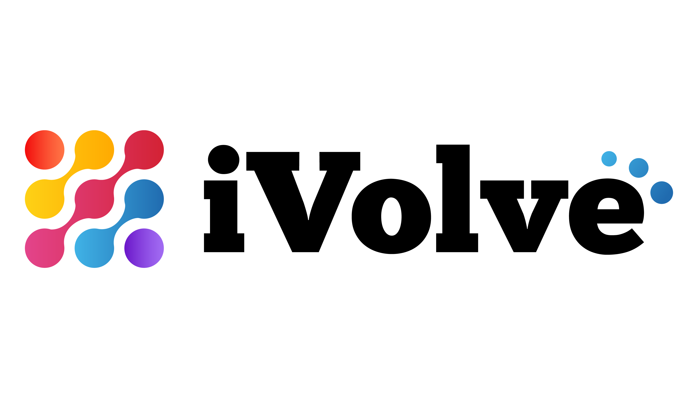

<div align="center">


&nbsp;&nbsp;&nbsp;&nbsp;


# CloudDevOps Project

### End-to-End DevOps Pipeline on AWS

*NTI DevOps Training Track × iVolve Technologies*

[](https://github.com/lotfi029/CloudDevOpsProject)
[](https://www.terraform.io/)
[](https://www.jenkins.io/)
[](https://kubernetes.io/)
[](https://argoproj.github.io/cd/)
[](https://www.docker.com/)
[](https://aws.amazon.com/)

</div>

---

## Overview

A complete end-to-end DevOps pipeline that provisions AWS infrastructure, configures a Jenkins CI server, builds and scans a containerized Flask application, and deploys it to an EKS cluster using GitOps with ArgoCD — all automated from a single `git push`.

---

## Architecture

```
Developer → GitHub → Jenkins (EC2)
                         │
              ┌──────────┼──────────────────┐
              │          │                  │
           Build      Scan (Trivy)     Push → ECR
              │
         Update kubernetes/deployment.yml
              │
         Push → GitHub (main)
              │
              ▼
           ArgoCD  ──────────────→  EKS Cluster
         (watches repo)              Namespace: ivolve
                                     Pod 1 → Node 1 (AZ-a)
                                     Pod 2 → Node 2 (AZ-b)
                                     NGINX Ingress → LoadBalancer
```

### AWS Network Layout

```
VPC  10.0.0.0/16
├── Public  us-east-1a  10.0.1.0/24   Jenkins EC2 + NAT Gateway
├── Public  us-east-1b  10.0.2.0/24   Load Balancers
├── Private us-east-1a  10.0.3.0/24   EKS Worker Node 1
└── Private us-east-1b  10.0.4.0/24   EKS Worker Node 2
```

---

## Tech Stack

| Layer | Tool | Purpose |
|-------|------|---------|
| Source Control | GitHub | Code + GitOps manifest store |
| Containerization | Docker | Flask app image |
| Registry | Amazon ECR | Container image storage |
| Infrastructure | Terraform + AWS | VPC, EC2, EKS, ECR provisioning |
| Configuration | Ansible | Jenkins server setup |
| CI | Jenkins | Build, scan, push, update manifests |
| Security Scan | Trivy | Container vulnerability scanning |
| Orchestration | Kubernetes (EKS 1.32) | Container runtime |
| Ingress | NGINX Ingress Controller | External traffic routing |
| CD | ArgoCD | GitOps continuous deployment |

---

## Repository Structure

```
CloudDevOpsProject/
│
├── app.py                        # Flask application
├── requirements.txt              # Python dependencies
├── templates/index.html          # HTML template
├── static/style.css              # CSS styles
├── Dockerfile                    # Container definition
├── .dockerignore                 # Excludes infra files from image
│
├── terraform/                    # Infrastructure as Code
│   ├── main.tf                   # Root module + S3 backend
│   ├── variables.tf
│   ├── outputs.tf
│   └── modules/
│       ├── network/              # VPC, subnets, IGW, NAT, NACL
│       ├── server/               # Jenkins EC2 + Security Group
│       ├── eks/                  # EKS cluster + node group
│       └── ecr/                  # ECR repository
│
├── ansible/
│   ├── ansible.cfg               # Roles path, host key, inventory plugin
│   ├── inventory/aws_ec2.yml     # Dynamic inventory (tag: Role=jenkins)
│   ├── playbooks/configure_jenkins.yml
│   └── roles/
│       ├── java/                 # OpenJDK 21
│       ├── jenkins/              # Jenkins LTS + GPG key handling
│       └── packages/             # Docker, Trivy, AWS CLI v2, kubectl
│
├── kubernetes/
│   ├── namespace.yml             # ivolve namespace
│   ├── deployment.yml            # 2 replicas, pod anti-affinity
│   ├── service.yml               # ClusterIP on port 80
│   └── ingress.yml               # NGINX ingress with LB hostname
│
├── jenkins/
│   ├── Jenkinsfile               # 6-stage declarative pipeline
│   └── shared-library/vars/
│       ├── buildImage.groovy
│       ├── scanImage.groovy
│       ├── pushImage.groovy
│       ├── deleteLocalImage.groovy
│       ├── updateManifests.groovy
│       └── pushManifests.groovy
│
├── argocd/
│   └── application.yml           # Auto-sync GitOps application
│
└── docs/                         # Per-topic README files
    ├── README-01-github.md
    ├── README-02-docker.md
    ├── README-03-terraform.md
    ├── README-04-ansible.md
    ├── README-05-kubernetes.md
    ├── README-06-jenkins.md
    ├── README-07-argocd.md
    └── README-08-architecture.md
```

---

## Pipeline Stages

| # | Stage | Tool | What Happens |
|---|-------|------|-------------|
| 1 | **Build Image** | Docker | `docker build -t clouddevops-app:$BUILD_NUMBER .` |
| 2 | **Scan Image** | Trivy | Scan for HIGH/CRITICAL CVEs — reports, does not block |
| 3 | **Push Image** | ECR | Login via IAM role, tag and push to ECR |
| 4 | **Delete Locally** | Docker | Remove local image to free disk space |
| 5 | **Update Manifests** | sed | Patch `kubernetes/deployment.yml` with new image tag |
| 6 | **Push Manifests** | Git | Commit and push to GitHub → triggers ArgoCD |

---

## Getting Started

### Prerequisites

- AWS CLI configured (`aws configure`)
- Terraform ≥ 1.5
- Ansible ≥ 2.14 (in a Python virtualenv with `boto3`)
- `kubectl`
- Docker

### 1 — Provision Infrastructure

```bash
cd terraform/

# One-time S3 backend setup
aws s3api create-bucket --bucket clouddevops-tfstate --region us-east-1
aws s3api put-bucket-versioning --bucket clouddevops-tfstate \
  --versioning-configuration Status=Enabled
aws dynamodb create-table --table-name clouddevops-tfstate-lock \
  --attribute-definitions AttributeName=LockID,AttributeType=S \
  --key-schema AttributeName=LockID,KeyType=HASH \
  --billing-mode PAY_PER_REQUEST --region us-east-1

terraform init
terraform apply -var="key_name=your-keypair"
```

### 2 — Configure Jenkins Server

```bash
source ~/.ansible-venv/bin/activate
pip install boto3 botocore
ansible-galaxy collection install amazon.aws

cd ansible/
ansible-playbook -i inventory/aws_ec2.yml \
  playbooks/configure_jenkins.yml \
  --private-key ~/.ssh/your-keypair.pem
```

### 3 — Connect kubectl to EKS

```bash
aws eks update-kubeconfig --region us-east-1 --name clouddevops-eks
kubectl get nodes
```

### 4 — Install NGINX Ingress Controller

```bash
kubectl apply -f https://raw.githubusercontent.com/kubernetes/ingress-nginx/controller-v1.10.0/deploy/static/provider/aws/deploy.yaml
kubectl get svc -n ingress-nginx   # Note the EXTERNAL-IP
```

### 5 — Install ArgoCD & Deploy

```bash
kubectl create namespace argocd
kubectl apply -n argocd \
  -f https://raw.githubusercontent.com/argoproj/argo-cd/stable/manifests/install.yaml
kubectl apply -f argocd/application.yml
```

### 6 — Configure Jenkins

1. Open `http://<jenkins_ip>:8080`
2. Enter initial admin password (printed by Ansible)
3. Install: **Docker Pipeline**, **Pipeline**, **Git** plugins
4. Add credential `github-credentials` (username + GitHub token with `repo` scope)
5. Register Shared Library: name=`clouddevops-shared-library`, path=`jenkins/shared-library`
6. Create Pipeline job → SCM → Script Path: `jenkins/Jenkinsfile`
7. Attach IAM instance profile with ECR + EKS permissions to Jenkins EC2

### 7 — Trigger the Pipeline

Click **Build Now** in Jenkins. After completion, ArgoCD automatically rolls out the new image to EKS.

---

## Application

Source: [Ibrahim-Adel15/FinalProject](https://github.com/Ibrahim-Adel15/FinalProject)
A Flask web app serving the NTI × iVolve graduation page on port 5000.

**Live URL:**
```
http://a003b45b6f46f4faebe59ef344206b1c-fc4fbd4976084767.elb.us-east-1.amazonaws.com
```

---

## Terraform Modules

| Module | Resources |
|--------|-----------|
| `network` | VPC, 2 public + 2 private subnets, IGW, NAT GW, route tables, NACL |
| `server` | EC2 `t3.small` Ubuntu 22.04, Security Group (22, 8080) |
| `eks` | EKS 1.32 cluster, 2× `t3.small` worker nodes across 2 AZs |
| `ecr` | ECR repo, scan-on-push, lifecycle policy (keep last 10 images) |

---

## Ansible Roles

| Role | What It Does |
|------|-------------|
| `java` | Installs OpenJDK 21 (Jenkins LTS requires Java 21+) |
| `jenkins` | Installs Jenkins LTS with modern GPG key handling for Ubuntu 22.04+ |
| `packages` | Installs Docker CE, Trivy, AWS CLI v2, kubectl |

---

## Kubernetes Design

- **Namespace:** `ivolve`
- **Replicas:** 2, each guaranteed on a separate node via `podAntiAffinity`
- **Image:** Auto-updated by Jenkins pipeline on every build
- **Ingress:** NGINX backed by AWS Network Load Balancer
- **Health checks:** Liveness + Readiness probes on `GET /` port 5000

---

## Documentation

| Topic | File |
|-------|------|
| GitHub Setup | [docs/README-01-github.md](docs/README-01-github.md) |
| Docker | [docs/README-02-docker.md](docs/README-02-docker.md) |
| Terraform | [terraform/README.md](docs/README-03-terraform.md) |
| Ansible | [ansible/README.md](docs/README-04-ansible.md) |
| Kubernetes | [kubernetes/README.md](docs/README-05-kubernetes.md) |
| Jenkins | [jenkins/README.md](docs/README-06-jenkins.md) |
| ArgoCD | [argocd/README.md](docs/README-07-argocd.md) |
| Architecture & Setup | [docs/README-08-architecture.md](docs/README-08-architecture.md) |

---

<div align="center">

© 2025 NTI DevOps Track × iVolve Technologies

</div>